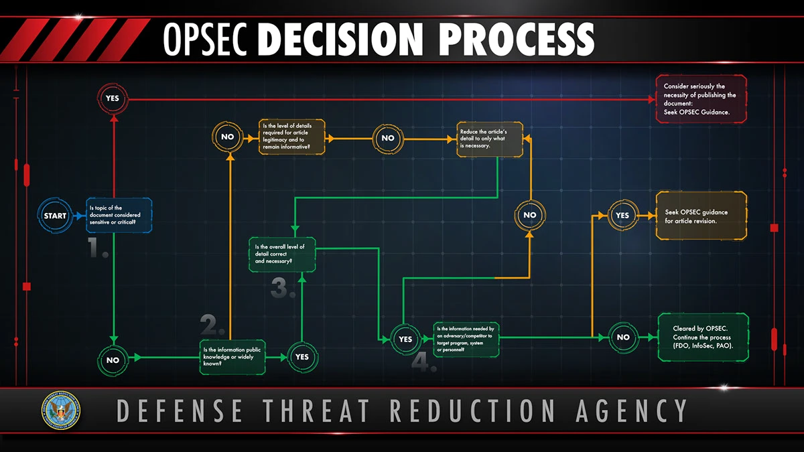
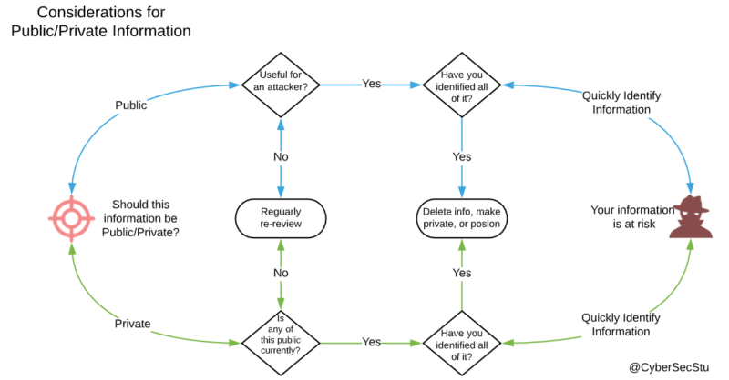
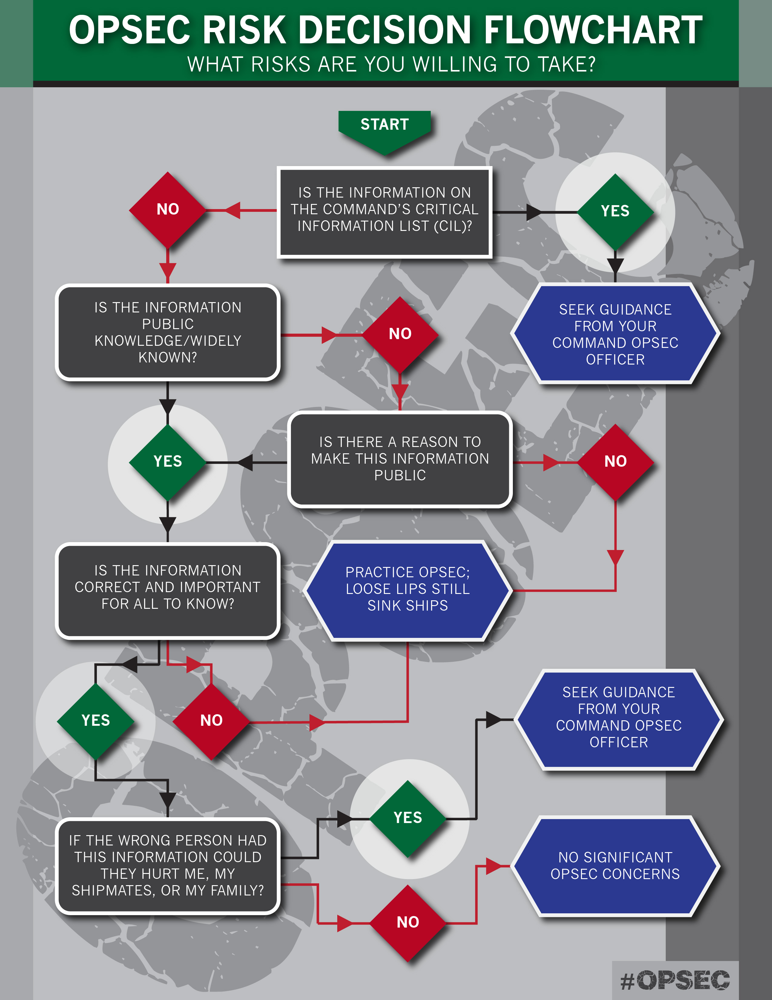

# 🛡️ **OPSEC-HUB-FR** 
  

  

  

🇫🇷 <strong>OPSEC-HUB-FR</strong> constitue une plateforme stratégique à l'intention des apprenants et novices en sécurité opérationnelle : elle centralise des ressources techniques, des protocoles éprouvés et des tutoriels structurés, principalement en français avec des extensions en anglais, pour maîtriser la sécurisation des données critiques, anticiper les vulnérabilités de traçabilité et implémenter des mesures OPSEC de manière anticipée, méthodique et formatrice.  

🇬🇧 <strong>OPSEC-HUB-FR</strong> serves as a strategic platform for learners and newcomers in operational security: it consolidates technical resources, proven protocols, and structured tutorials, primarily in French with English extensions, to master the safeguarding of critical data, anticipate traceability vulnerabilities, and implement OPSEC measures in an anticipatory, methodical, and educational framework.  

  

## 📑 Table des matières

- [🛡️ OPSEC Ressources](#opsec-ressources)
  - [✍️ Articles](#articles)
  - [🧭 Méthodes](#methodes)
  - [📚 Guides / PDF (FR/EN)](#guides-pdf)
  - [🎥 Vidéos](#videos)
  - [🔧 Outils](#tools)
  - [🧰 Frameworks](#frameworks)
  - [🔍 Autres Sources](#autre-sources)
  - [📋 Boards](#boards)
    
- [🛡️ OPSEC Communauté](#opsec-communaute)
  - [🇫🇷  Communautés FR](#communautes-fr)
  - [🌍 Communautés EN](#communautes-en)
    
- [🛡️ OPSEC Formations](#opsec-formations)
  - [🎓 Formations gratuites](#formations-gratuites)
  - [💼 Formations / certifications payantes](#formations-payantes)
  - [🕹️ Challenges](#challenges)
    
- [🛡️ OPSEC Jobs](#opsec-jobs)
  - [🇫🇷 Entreprises françaises spécialisées en OPSEC](#entreprises-francaises)
  - [🌍 Entreprises internationales spécialisées en OPSEC](#entreprises-internationales)
  - [🎖️ Bonus](#bonus)

 

# 🛡️ OPSEC Ressources
 

## ✍️ Articles
- [OpSec 101 : Guide pour débutants](https://opsec101.org/) – Introduction rationnelle au processus OPSEC.
- [OPSEC Introduction (187FW)](https://www.187fw.ang.af.mil/About/OPSEC/) – Importance de l'OPSEC pour protéger les informations critiques.
- [Qu'est-ce que l'OPSEC ? (Fortinet)](https://www.fortinet.com/fr/resources/cyberglossary/operational-security) – Explication détaillée de l'OPSEC en français, processus de gestion des risques.
- [Qu'est-ce que l'OPSEC ? (Proofpoint)](https://www.proofpoint.com/fr/threat-reference/operational-security-opsec) – Pilier essentiel de la cybersécurité, pratiques pour empêcher les fuites d'informations sensibles.
- [Qu'est-ce que l'OPSEC ? (Check Point)](https://www.checkpoint.com/fr/cyber-hub/threat-prevention/what-is-soc/what-is-operational-security-opsec/) – Identification des menaces et vulnérabilités potentielles via OPSEC.
- [OPSEC in OSINT: Protecting Yourself While Investigating](https://sosintel.co.uk/opsec-in-osint-protecting-yourself-while-investigating/) – Intégration OPSEC et OSINT.
- [OpSec Oversights: How Cybercrooks Get Caught](https://www.theregister.com/2025/07/01/terrible_tales_of_opsec_oversights/) – Échecs célèbres.
- [What Were Ross Ulbricht's Biggest Mistakes?](https://plasbit.com/blog/what-were-ross-ulbricht-biggest-mistakes) – Analyse des erreurs de Silk Road.
- [Proactive Paranoia: AlphaBay Case](https://reallifemag.com/proactive-paranoia/) – Leçons d'Alexandre Cazes.
- [Crypto OPSEC Guide Part 1: Private Key Phishing Security](https://threesigma.xyz/blog/opsec/crypto-opsec-guide-part-1-private-key-phishing-security) – Guide sur la sécurité des clés privées en crypto.
- [OPSEC: Everyone Has Something to Hide – Part 3](https://www.tripwire.com/state-of-security/opsec-everyone-people-something-hide-part-3) – OPSEC pour tous, focus sur les fuites.
---
 

## 🧭 Méthodes
- [Principes Fondamentaux de l'OPSEC (Cycle NSA)](https://opsec101.org/#the-opsec-process) – 5 étapes : Identifier, Détecter, Évaluer, Analyser, Appliquer.
- [Surveillance Self-Defense Guide (EFF)](https://ssd.eff.org/) – Guide complet contre la surveillance.
- [OPSEC & PRIVACY HANDBOOK](https://medium.com/@varppi/opsec-privacy-handbook-5e0a012c58f6) – Manuel pratique.
- [Minimum Viable OPSEC](https://plainshift.io/blog/minimum-viable-opsec/) – OPSEC minimal pour devs crypto.
- [OPSEC: More Than a Checklist](https://www.afmc.af.mil/News/Article-Display/Article/4206156/opsec-more-than-a-checklist/) – Au-delà des listes.
- [OPSEC Policy Checklist (DNI)](https://www.dni.gov/files/NCSC/documents/nittf/OPSEC_Program_Policy_Checklist.pdf) – Checklist officielle.
- [OPSEC Guide (Tilde Wiki)](https://wiki.tilde.fun/guide/opsec) – Processus OPSEC en 5 étapes, réponse à un compromis et conseils mobiles.
---
 

## 📚 Guides / PDF (FR/EN)
- [Identity Theft Prevention (DHS PDF)](https://www.dhs.gov/sites/default/files/2024-11/24_110824_identify-theft-508.pdf) – Prévention des vols d'identité (EN).
- [OPSEC Fundamentals for Remote Red Teams (PDF)](https://www.blackhillsinfosec.com/wp-content/uploads/2021/03/SLIDES_OPSECFundamentalsRemoteRedTeams-1.pdf) – Bases pour équipes distantes.
- [Crypto-OpSec-SelfGuard-RoadMap (GitHub Guide)](https://github.com/OffcierCia/Crypto-OpSec-SelfGuard-RoadMap) – Roadmap crypto et OPSEC, avec 25 problèmes et contre-mesures.
- [EFF Surveillance Self-Defense Basics](https://ssd.eff.org/module-categories/basics) – Bases de défense.
- [OPSEC Guide (Zycher)](https://whos-zycher.github.io/opsec-guide/) – Guide complet avec checklists VM.
- [OpSec Guide (Scrut1ny)](https://github.com/Scrut1ny/OpSec-Guide) – Insights pour privacy, anonymat et sécurité personnelle.
- [The Guide To Online Anonymity (THGTOA)](https://github.com/Anon-Planet/thgtoa) – Guide complet pour anonymat en ligne et OPSEC.
- [OPSEC Academy README](https://github.com/opsecacademy/opsecacademy.github.io/blob/main/README.md) – Aperçu des ressources éducatives OPSEC.
- [OPSEC Analysis Resources (DNI PDF)](https://www.dni.gov/files/NCSC/documents/nittf/OPSEC-Analysis-Resources.pdf) – Ressources d'analyse OPSEC officielles du DNI (EN).
---
 

## 🎥 Vidéos & Podcasts

- [SALTINBANK - OSINT & OPSEC](https://www.youtube.com/watch?v=_8vvj5ck3ng) - Lien entre les deux domaines
- [SALTINBANK - INTRODUCTION A l'OPSEC](https://www.youtube.com/watch?v=Ao4c7jzW7Js) - Le contexte
- [SALTINBANK - REDTEAM//OPSEC framework I](https://www.youtube.com/watch?v=xqPgyeR1u1U) - aller plus loin
- [SALTINBANK - REDTEAM//OPSEC framework III](https://www.youtube.com/watch?v=xqPgyeR1u1U) - aller plus loin
- [SALTINBANK - REDTEAM//OPSEC framework IV](https://www.youtube.com/watch?v=m92pmIXxu5Q) - aller plus loin
- [OPSEC Basics Explained](https://www.youtube.com/watch?v=oV07c-1EDHs) – Introduction aux bases.
- [Advanced OPSEC Techniques](https://www.youtube.com/watch?v=qsN44n0AQD8) – Techniques avancées.
- [OPSEC in Practice](https://www.youtube.com/watch?v=6OTVOUicKOI) – Exemples pratiques.
- [Dark Web OPSEC Rules](https://www.youtube.com/watch?v=teRYkWkn1sU) – Règles pour le Dark Web.
- [Crypto OPSEC Roadmap](https://www.youtube.com/watch?v=StSLxFbVz0M) – Roadmap crypto.
- [EFF Surveillance Self-Defense](https://www.youtube.com/watch?v=u5Lv_HXICpo) – Guide EFF en vidéo.
- [Tails OS Tutorial](https://www.youtube.com/results?search_query=tails+os+opsec) – Tutoriels Tails.
---
 

## 🔧 Outils
**Configuration Environnement :**
- [Tails OS](https://tails.net/) – Système portable amnésique pour isolation.
- [VeraCrypt](https://www.veracrypt.fr/) – Chiffrement de disques.
- [VirtualBox](https://www.virtualbox.org/) – Machines virtuelles pour isolation.
- [Cloud personnelle](https://kasm.com/cloud-personal ) – VM en ligne.
- [HiddenVM](https://github.com/aforensics/HiddenVM) – Lance VMs dans Tails pour anti-forensique et deniability.
- [Awesome GrapheneOS Guide](https://github.com/iAnonymous3000/awesome-grapheneos-guide) – Guide pour OS mobile privacy-focused (GrapheneOS).

**Navigation & Browser :**
- [Brave Browser](https://brave.com/) – Bloque trackers par défaut.
- [Tor Browser](https://www.torproject.org/download/) – Anonymat via Tor.
- Extensions : [HTTPS Everywhere (EFF)](https://www.eff.org/https-everywhere), [uBlock Origin](https://github.com/gorhill/uBlock), [Privacy Badger (EFF)](https://privacybadger.org/), [User-Agent Switcher](https://addons.mozilla.org/en-US/firefox/addon/user-agent-string-switcher/).
- Tests : [Cover Your Tracks (Panopticlick successor)](https://coveryourtracks.eff.org/), [AmIUnique](https://amiunique.org/), [BrowserLeaks](https://browserleaks.com/).

**Masquage IP :**
- [Mullvad VPN](https://mullvad.net/) – No-logs, paiement crypto.
- [ProtonVPN](https://protonvpn.com/) – Gratuit/premium, open-source.
- [Comparatif VPN OPSEC 2025](https://www.cnet.com/tech/services-and-software/best-vpn/) – NordVPN, Surfshark, etc.

**Comptes & Identités :**
- [Fake Name Generator](https://www.fakenamegenerator.com/) – Identités fictives.
- [ThisPersonDoesNotExist](https://thispersondoesnotexist.com/) – Photos IA.
- [ProtonMail](https://proton.me/mail) – Email chiffré.
- [Temp Mail](https://temp-mail.org/) – Emails jetables.
- [SMS-Activate](https://sms-activate.org/) – Numéros virtuels.
- [KeePassXC](https://keepassxc.org/) – Gestionnaire de mots de passe.

**Recherche & Métadonnées :**
- [DuckDuckGo](https://duckduckgo.com/) – Moteur privé.
- [Searx](https://searx.space/) – Métamoteur.
- [Sherlock](https://github.com/sherlock-project/sherlock) – Recherche usernames.
- [ExifTool](https://exiftool.org/) – Nettoyage métadonnées.

**Communication :**
- [Signal](https://signal.org/) – Messagerie E2EE.
- [PGP/OpenPGP](https://www.openpgp.org/) – Chiffrement emails.

**Autres :**
- [MITRE ATT&CK](https://attack.mitre.org/) – Framework pour modéliser menaces.
---
 

## 🧰 Frameworks
- [OSINT Framework (pour OPSEC)](https://osintframework.com/) – Arbre d'outils, adapté à la détection de fuites.
- [Crypto-OpSec Roadmap (MindMeister Integration)](https://github.com/OffcierCia/Crypto-OpSec-SelfGuard-RoadMap) – Visualisez ce roadmap avec [MindMeister](https://www.mindmeister.com/), un outil de mind mapping en ligne (GDPR-compliant, collaboration temps réel) pour organiser idées, processus et contre-mesures OPSEC.
---
 

## 🔍 Autres Sources
- [OpSec Techniques](https://opsectechniques.com/) – Techniques avancées (contenu limité, focus sur cloaking).
- [Basic OPSEC Tips for OSINT](https://www.osintcurio.us/2019/04/18/basic-opsec-tips-and-tricks-for-osint-researchers/index.htm) – Conseils pour chercheurs.
- [Parlons d'OPSEC (Reddit)](https://www.reddit.com/r/hacking/comments/vj0zb0/lets_talk_about_opsec/?tl=fr) – Discussion sur l'OPSEC comme minimisation des ressources et risques.
- [Conditions préalables de l'OPSEC (Infuse Quest)](https://infuse.quest/fr/learning-path/2/module-2/) – Configuration d'un environnement sûr pour l'analyse de malwares.
---
 

## 📋 Boards
- [OPSEC Dashboard (Start.me)](https://start.me/p/rxE68b/opsec?locale=fr) – Compilation de ressources OPSEC en français, avec liens vers articles, outils et guides pratiques.
- [OPSEC Online Privacy Dashboard (Start.me)](https://start.me/p/BnrKpe/02-opsec-online-privacy?locale=fr) – Tableau de bord sur la privacy en ligne et OPSEC, incluant des ressources pour la protection numérique quotidienne.
---
 

# 🛡️ OPSEC Communauté
  

## 🇫🇷 Communautés FR

- **[Discord OPSEC FR (Viziora)](https://disboard.org/fr/server/1435275464707932401)** 🟢 **Actif**  
  Discussions OPSEC en français sur Discord.  
  Échanges sur outils et menaces.

---
 

## 🌍 Communautés EN

- **[r/opsec (Reddit)](https://www.reddit.com/r/opsec/)** 🟢 **Actif**  
  Communauté principale OPSEC (100k+ membres).  
  Discussions sur fuites, outils et cas réels.

- **[OPSEC Discord](https://disboard.org/en/servers/tag/opsec)** 🟢 **Actif**  
  Serveur dédié à privacy, ethical hacking et Linux-first OPSEC.  
  Partage de ressources et bots.

- **[OffSec Discord](https://discord.com/invite/offsec)** 🟢 **Actif**  
  Communauté Offensive Security pour OPSEC en pentesting.  
  85k+ membres, échanges pros.

- **[Qubes OS Forum](https://forum.qubes-os.org/t/rate-my-opsec/17871)** 🟠 **Peu actif**  
  Discussions OPSEC avec VMs isolées.

---
 

# 🛡️ OPSEC Formations
 

## 🎓 Formations gratuites
- [Flare Academy Webinars](https://flare.io/glossary/opsec-training/) – Webinars gratuits sur OPSEC.
- [OPSEC Awareness (CDSE)](https://www.cdse.edu/Training/Operations-Security/) – Bases OPSEC.
- [NITTF OPSEC Training](https://www.dni.gov/index.php/ncsc-how-we-work/ncsc-nittf/ncsc-nittf-training) – Formation nationale gratuite.
- [Red Team OPSEC (TryHackMe)](https://tryhackme.com/room/opsec) – Exercices interactifs.
- [Surveillance Self-Defense (EFF)](https://ssd.eff.org/) – Guide et modules gratuits.
- [ICS OPSEC (CISA)](https://www.cisa.gov/resources-tools/programs/ics-training-available-through-cisa) – OPSEC pour systèmes critiques.
- [OPSEC Academy](https://opsecacademy.org/) – Éducation décentralisée et sécurisée sur OPSEC.
---
 

## 💼 Formations / certifications payantes
- [OPSEC Certified Professional (OCP)](https://opsecsociety.org/certifications/) – Certification pro OPSEC.
- [Certified OPSEC Professional (COPSECP)](https://niccs.cisa.gov/training/catalog/tonex/certified-operational-security-opsec-professional-copsecp) – Formation + certif.
- [OPS101: OpSec Fundamentals](https://www.securitycompass.com/training_courses/ops101-opsec-fundamentals/) – Bases pour déploiement.
- [OpSec - Privacy for Security Pros (Just Hacking)](https://www.justhacking.com/course/opsec-privacy-for-security-professionals/) – Cours à prix libre (min. 10$).
- [PEN-200: OSCP+ (OffSec)](https://www.offsec.com/courses/pen-200/) – Pentesting avec OPSEC.
- [Operational Security and Privacy (My OSINT Training)](https://www.myosint.training/courses/opsec-and-privacy) – 2h sur configs personnalisées.
---
 

## 🕹️ Challenges
- [TryHackMe OPSEC Room](https://tryhackme.com/room/opsec) – Défis Red Team.
- [EFF SSD Scenarios](https://ssd.eff.org/module-categories/tool-guides) – Simulations surveillance.
- [Qubes OPSEC Rating](https://forum.qubes-os.org/t/rate-my-opsec/17871) – Auto-évaluation VM.
---
 

# 🛡️ OPSEC Jobs
 

## 🇫🇷 Entreprises françaises spécialisées en OPSEC
Voici une liste d’entreprises françaises axées sur OPSEC, privacy et cybersécurité.

- **Proton (Suisse/FR ops)** – Outils pour OPSEC. [Site](https://protonvpn.com/)
- **Mullvad (EU/FR)** – VPN anonyme. [Site](https://mullvad.net/)
---
 

## 🌍 Entreprises internationales spécialisées en OPSEC
- **OpSec Security (Global)** – Protection intégrée pour brands. [Site](https://www.opsecsecurity.com/)
- **EFF (US)** – Advocacy et outils OPSEC. [Site](https://www.eff.org/)
- **Tor Project (Global)** – Anonymat réseau. [Site](https://www.torproject.org/)
---
  

# 🎖️ Bonus

Le processus OPSEC (Operations Security) est une méthode systématique pour identifier, contrôler et protéger les informations critiques contre les menaces potentielles. Il est applicable à tous, que ce soit dans le contexte militaire, professionnel, personnel ou même pour la sécurité des cryptomonnaies. Ce guide suit le flux standard du processus OPSEC, enrichi par des ressources spécialisées. Le flux se compose de cinq étapes clés, représentées ci-dessous en tableau pour plus de clarté.

| Étape | Description Brève | Objectif Principal |
|-------|-------------------|--------------------|
| 1. Identifier les informations critiques | Déterminer ce qui doit être protégé. | Éviter la divulgation involontaire. |
| 2. Analyser les menaces | Identifier les acteurs malveillants. | Comprendre les intentions et capacités. |
| 3. Analyser les vulnérabilités | Évaluer les faiblesses internes. | Détecter les points d'entrée potentiels. |
| 4. Évaluer les risques | Calculer la probabilité et l'impact. | Prioriser les actions. |
| 5. Appliquer les contre-mesures | Mettre en place des protections. | Réduire les risques résiduels. |

Ce processus est itératif et doit être revu régulièrement, car les menaces évoluent (par exemple, phishing en crypto ou exposition sur les réseaux sociaux).
  

Voici trois illustrations pour visualiser le processus. 

1. **Diagramme du Flux OPSEC Complet** :    
     
   [Source](https://www.behance.net/gallery/138155591/OPSEC-Security-Awareness-Month#) 
   

2. **Identification des Informations Critiques** :    
     
   [Source](https://www.tripwire.com/state-of-security/opsec-everyone-people-something-hide-part-3) 

3. **Matrice d'Évaluation des Risques** :    
     
   [Source](http://ribluestarmoms.com/opsec-operations-security/) 
   
---
  

# Licence

Apache 2.0 voir page de licence

> 📌 *Dernière mise à jour : Novembre 2025*  
> _Contributions bienvenues via Pull Request._
